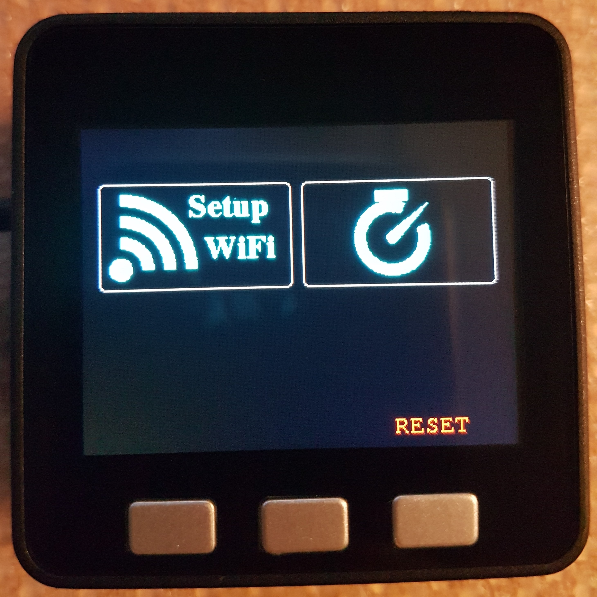
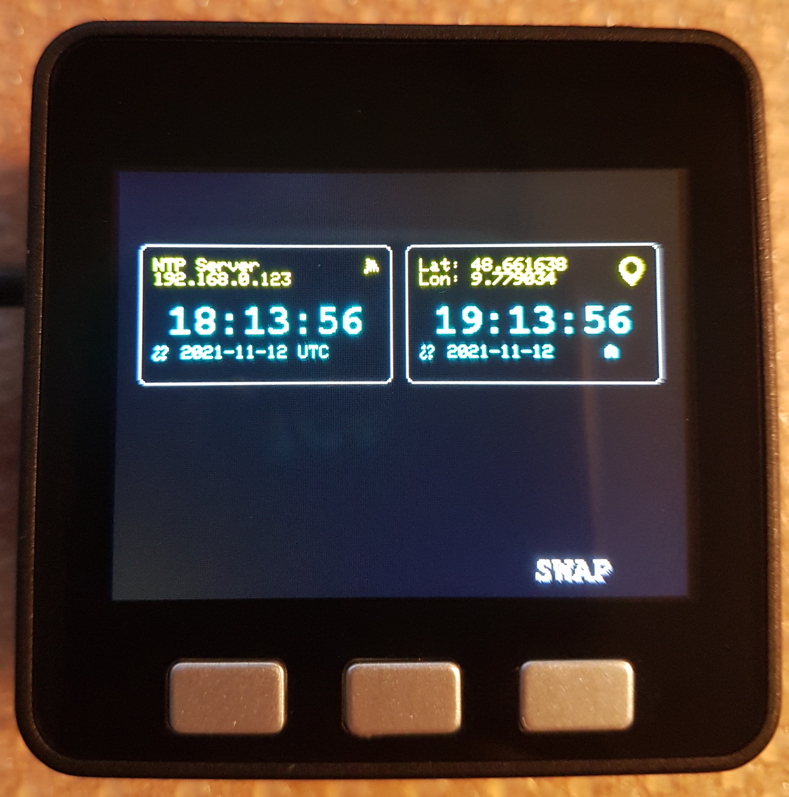
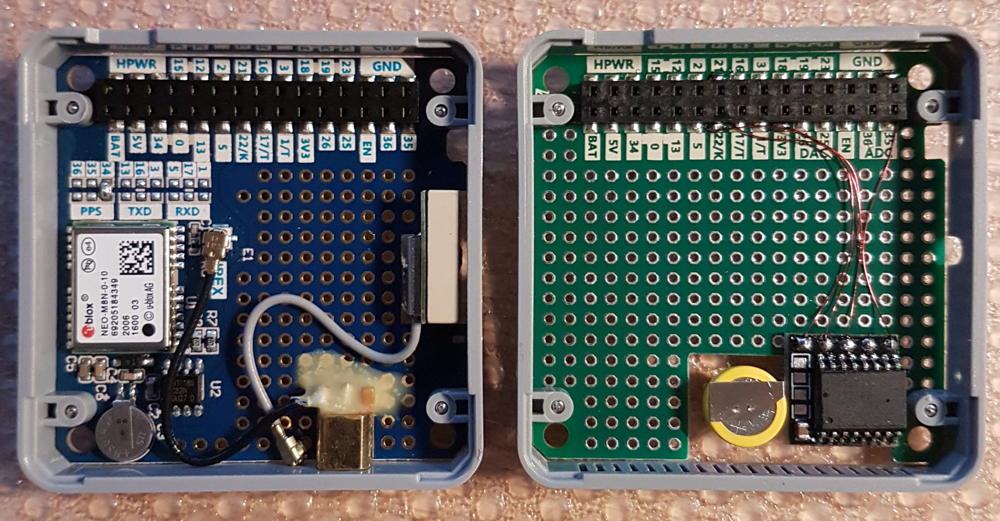

# 180662 mini NTP for the M5Stack Core

| Startup                                                                                               | Elektor mini NTP running                                                                                       |
|-------------------------------------------------------------------------------------------------------|----------------------------------------------------------------------------------------------------------------|
|  |  |

License: GPL3.0-or-later
###### 

    Firmware for Elektorproject 180662 is free software: you can redistribute it and/or modify
    it under the terms of the GNU General Public License as published by
    the Free Software Foundation, either version 3 of the License, or
    (at your option) any later version.

    but WITHOUT ANY WARRANTY; without even the implied warranty of
    MERCHANTABILITY or FITNESS FOR A PARTICULAR PURPOSE.  See the
    GNU General Public License for more details.

    You should have received a copy of the GNU General Public License
    along with Firmware for Elektorproject 180662.  If not, see <https://www.gnu.org/licenses/>.

#

Code for the GPS based NTP for the M5Stack Core.
Quick and dirty port  for a M5Stack system (just replaced the OLEDs by two virtual displays on the M5Stacks integrated TFT, no improvments/optimizations):
*  M5Stack Core BASIC SKU:K001 ( https://docs.m5stack.com/en/core/basic )
*  M5Stack Module GPS SKU:M003 (https://docs.m5stack.com/en/module/gps )
*  M5Stack Module PROTO SKU:M001 ( https://docs.m5stack.com/en/module/proto ) with DS3231 based I²C RTC Module, e.g those used for the Pi

## Software 

The software is written using the arduino framwork for the ESP32. Also you need to compile the code following libraries to be present:
 *  M5Stack by M5Stack ( https://docs.m5stack.com/en/quick_start/m5core/arduino ) 
 *  Time by Michael Magolis
 *  Ticker by Bert Melis
 *  TinyGPS++ ( https://github.com/mikalhart/TinyGPSPlus )  
 *  RTCLib by Adafruit
 *  ArduinoJson 6.10.0
 *  CRC32 by Christopher Baker

 Compile and upload the code to your **"M5Stack-Core-ESP32"**. Also upload the webpages from the "data" directoty with ["ESP32 Sketch Data Upload"](https://github.com/me-no-dev/arduino-esp32fs-plugin).

 ### GPIO Mapping
 The following pins are used:

## Button (Factory defaults/Swap displays):
| GPIO PIN  | Function  |
|-----------|-----------|
|  GPIO37   | Button C  |

## RTC (I²C):
| GPIO PIN  | Function  |
|-----------|-----------|
|  GPIO22   |  SCL      |
|  GPIO21   |  SDA      |

(Remark: the two pull-up resistors on the DS3231 board were removed)

## GPS (UART):
| GPIO PIN  | Function      |
|-----------|---------------|
| GPIO16    | UART RX       |
| GPIO17    | UART TX       |
| GPIO34    | PPS Interrupt |

For more inforamtion have a look at: https://www.elektormagazine.com/labs/mini-ntp-server-with-gps
